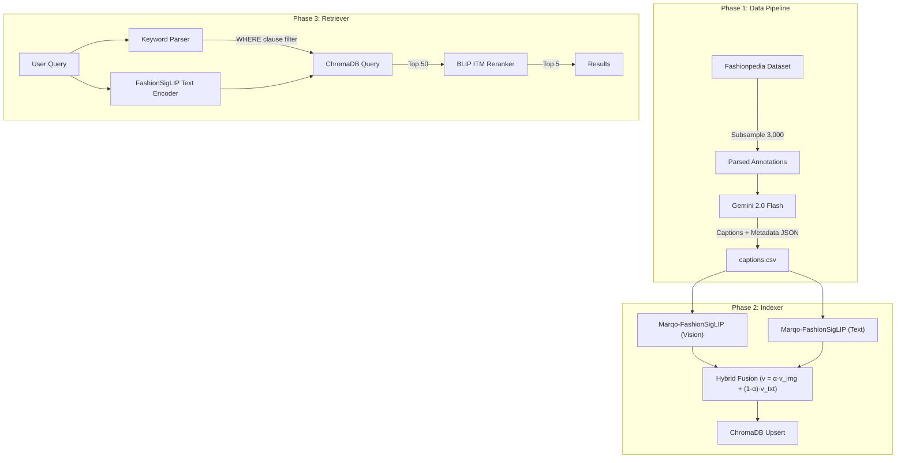

# Glance Fashion Retrieval: Multimodal Fashion & Context Search Engine 👕🔍


## 🌟 Overview

Glance Fashion Retrieval is an advanced, end-to-end multimodal search engine for fashion imagery. It allows users to query a large dataset of fashion images using natural language queries that describe not just the clothing (e.g., "blue shirt"), but also the **context**, **environment**, and **vibe** (e.g., "Casual weekend outfit for a city walk").

**Key Innovations:**
1. **Hybrid Fusion Embeddings**: Combines visual features from Marqo-FashionSigLIP with textual features derived from Gemini-generated synthetic captions.
2. **Metadata-Based Hybrid Search**: Uses structured metadata (extracted via LLM) to apply ChromaDB `WHERE` clause filtering before vector similarity search.
3. **BLIP Cross-Encoder Reranking**: Re-ranks the top-50 bi-encoder candidates using a cross-attention ITM (Image-Text Matching) head for high-precision compositional reasoning.

## 🏗️ Architecture



## 🚀 Quick Start

### 1. Installation

```bash
git clone https://github.com/yourusername/glance-fashion-retrieval.git
cd glance-fashion-retrieval
pip install -r requirements.txt
```

### 2. Configuration
Set your Gemini API key:
```bash
export GEMINI_API_KEY="your-api-key"
```

Adjust paths in `src/config.py` if your Fashionpedia dataset is located elsewhere.

### 3. Run Pipeline
```bash
# 1. Data Pipeline
python src/data_pipeline/subsample.py
python src/data_pipeline/parse_annotations.py
python src/data_pipeline/generate_captions.py

# 2. Indexer
python src/indexer.py

# 3. Retriever & Evaluation
python src/retriever.py
```

## 📂 Project Structure

```
glance-fashion-retrieval/
├── data/
│   ├── images/              # (Optional) Symlinks to images
│   ├── sampled_images.json
│   ├── image_tags.json
│   └── captions.csv         # Generated by Data Pipeline
├── notebooks/
│   ├── 01_data_pipeline_and_indexer.ipynb
│   └── 02_retriever_and_evaluation.ipynb
├── src/
│   ├── data_pipeline/
│   │   ├── generate_captions.py
│   │   ├── parse_annotations.py
│   │   └── subsample.py
│   ├── config.py
│   ├── indexer.py
│   ├── retriever.py
│   └── utils.py
├── vector_db/               # Auto-generated by ChromaDB
├── README.md
└── requirements.txt
```

## ⚙️ Technical Details
- **Base Bi-Encoder**: `Marqo/marqo-fashionSigLIP` (768-dim)
- **Cross-Encoder**: `Salesforce/blip-itm-base-coco`
- **Vector Database**: ChromaDB (Cosine similarity)
- **Dataset**: 3,000 images sampled from Fashionpedia (prioritizing natural backgrounds)

## 📊 Evaluation Results
*(To be populated after running the evaluation queries)*
- Q1: "A person in a bright yellow raincoat."
- Q2: "Professional business attire inside a modern office."
- Q3: "Someone wearing a blue shirt sitting on a park bench."
- Q4: "Casual weekend outfit for a city walk."
- Q5: "A red tie and a white shirt in a formal setting."

## 🔮 Future Work
- **Location/Weather Parsing**: Implement SpaCy/NLP extraction for specific geographic locations and weather conditions.
- **Precision Improvements**: Fine-tune the bi-encoder on hard negatives for better recall.
- **Scalability**: Move to Qdrant or Milvus for scaling to 1M+ images and implement ColBERT-style late interaction representations.
