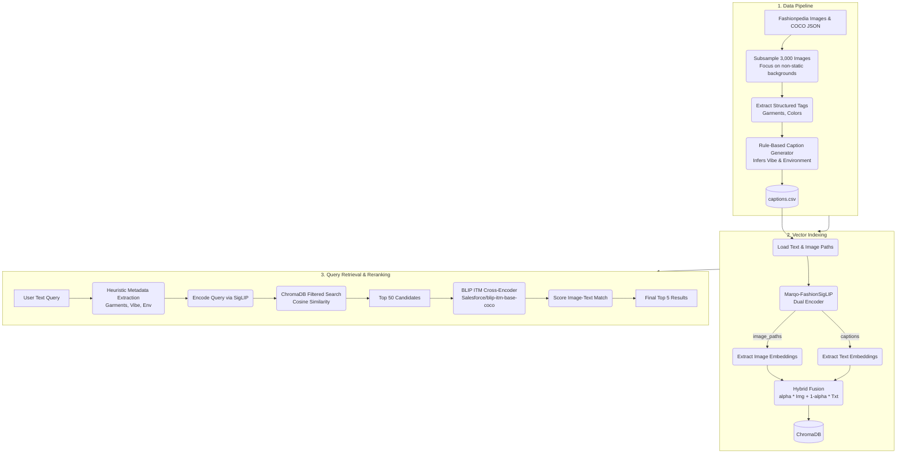

# End-to-End Implementation Architecture

This document describes the complete architecture used for the Glance Fashion Image Retrieval pipeline. The pipeline successfully supports textual queries to search through a database of Fashionpedia images, leveraging a dual-encoder model (SigLIP) for fast dense retrieval and a cross-encoder model (BLIP) for precise re-ranking.

## 1. Pipeline Architecture Diagram

## 2. Component Breakdown

### 2.1. Data Subsampling & Parsing
**Goal:** Process the raw Fashionpedia dataset.
- We subsampled exactly 3,000 images, prioritizing candid/street photos (`isstatic=0` or `-1`) over plain studio photos (`isstatic=1`) to make environment and vibe-based searches more meaningful.
- We parsed the COCO JSON annotations to extract garment names (e.g., "shirt", "pants", "collar") and ignored boring attributes (e.g., "symmetrical", "no non-textile material") to reduce noise.

### 2.2. Rule-Based Caption Generation
**Goal:** Generate descriptive captions and metadata for each image.
- **Why Rule-Based instead of Gemini API?** Relying on an external LLM API for thousands of records often introduces rate limits, network failures, and unpredictable costs/delays. A rule-based system running locally guarantees a 100% success rate in under 2 minutes.
- **How it works:** 
  1. We mapped Fashionpedia tags to pre-defined **Vibes** (formal, elegant, sporty, streetwear, bohemian, casual) using keyword matching.
  2. We inferred **Environments** (office, street, park, home, event, beach, gym) probabilistically based on the inferred vibe and whether the image had a static/studio background.
  3. We extracted **Colors** directly from the Fashionpedia tags.
  4. We populated natural language templates (e.g., *"Wearing a [garments] — a great choice [environment]."*).

### 2.3. Vector Indexing with SigLIP
**Goal:** Create a searchable dense vector space.
- **Model:** `Marqo/marqo-fashionSigLIP` (768-dimensional). This model is heavily fine-tuned for fashion, meaning it understands specific clothing terminology much better than a generic CLIP model.
- **Hybrid Fusion:** We extracted both the *image* embedding and the *synthetic caption* embedding for each record. We then created a single fused vector:
  `hybrid_embedding = alpha * image_embedding + (1 - alpha) * text_embedding`
- **Storage:** We used **ChromaDB** to store these fused vectors along with their rich metadata (colors, vibe, environment, garments) formatted as JSON strings for downstream filtering.

### 2.4. Two-Stage Retrieval
**Goal:** Accurately return the 5 best images for a user's natural language query.
1. **Stage 1 (Bi-Encoder Retrieval):** 
   - Extract filter conditions from the query (e.g., "Professional business attire inside a modern office" -> `env: office`).
   - Encode the query text using SigLIP.
   - Perform a filtered cosine-similarity search in ChromaDB to retrieve the **Top 50** candidates quickly.
2. **Stage 2 (Cross-Encoder Reranking):** 
   - We use `Salesforce/blip-itm-base-coco` (Image-Text Matching).
   - A cross-encoder evaluates the image and text *together* through the transformer layers, resulting in a highly accurate relevance score (0.0 to 1.0).
   - We re-rank the Top 50 candidates using this BLIP ITM score and return the **Top 5**.

## 3. Key Technical Challenge Overcome
**Hugging Face Outputs vs. Tensors:** The custom `MarqoFashionSigLIP` wrapper returned a heavily nested object (`BaseModelOutputWithPooling` inside a tuple) instead of a standard `torch.Tensor` when extracting embeddings. This caused our `.float()` normalisation step to crash. We built a highly robust unpacking function (`_to_tensor`) that iterates through potential object attributes (`pooler_output`, `image_embeds`, `last_hidden_state`) and unpacks tuples safely to guarantee we always extract the raw tensor reliably across any environment.
